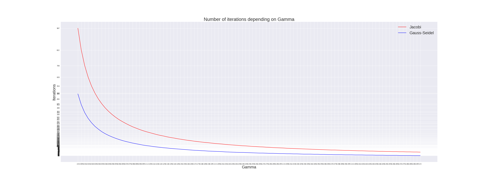

# NI-MPI - Domácí úkol ZS 2021/2022
#### Author:   Oleksandr Korotetskyi
#### Date:   27.11.2021
### Iteartive Solver of Equation Systems

## Results
### Mandatory variants

| Variant | Iterations | &nbsp;&nbsp;&nbsp;&nbsp;&nbsp;&nbsp;&nbsp;&nbsp;&nbsp;&nbsp;Details&nbsp;&nbsp;&nbsp;&nbsp;&nbsp;&nbsp;&nbsp;&nbsp;&nbsp;&nbsp; | Comment |
|:--------:|:-------------:|:--------------:|:--------------------------------:|
| Jacobi a | 15            | $\gamma = 5$   |                                  |
| Jacobi b | 987           | $\gamma = 2$   |                                  |
| Jacobi c | -             | $\gamma = 0.5$ | Iteration method does not converge |
| Gauss-Seidel a | 10 | $\gamma = 5$ |  |
| Gauss-Seidel b | 495 | $\gamma = 2$ |  |
| Gauss-Seidel c | - | $\gamma = 0.5$ | Iteration method does not converge |

### Optional variants
| Variant | Iterations | &nbsp;&nbsp;&nbsp;&nbsp;&nbsp;&nbsp;&nbsp;&nbsp;&nbsp;&nbsp;Details&nbsp;&nbsp;&nbsp;&nbsp;&nbsp;&nbsp;&nbsp;&nbsp;&nbsp;&nbsp; | Comment |
|:-:|:-:|:-:|:-:|
| Jacobi 2.004 | 850 | $\gamma = 2.004$ |  |
| Jacobi 4 | 20 | $\gamma = 4$   |  |
| Jacobi 16 | 7 | $\gamma = 16$   |  |
| Gauss-Seidel $2.004$ | 427 | $\gamma = 2.004$ |  |
| Gauss-Seidel 4 | 13 | $\gamma = 4$ |  |
| Gauss-Seidel 16 | 6 | $\gamma = 16$ |  |
| Gauss-Seidel $\omega = 0.5$ | 1488 | $\gamma = 2$, $\omega = 0.5$ |  |
| Gauss-Seidel $\omega = 1.5$ | 161 | $\gamma = 2$, $\omega = 1.5$ |  |
| Gauss-Seidel $\omega = 2$ | - | $\gamma = 2$, $\omega = 2$ | Iteration method does not converge |

In conclusion, it appears that Gauss-Seidel method takes the smaller number of iterations to solve the system of equations comparely to Jacobi method. The decrease of _omega_ (< 1) value in the case of Gauss-Seidel method increases the number of iterations required. In contrast, the increse reduces (up to 2).

